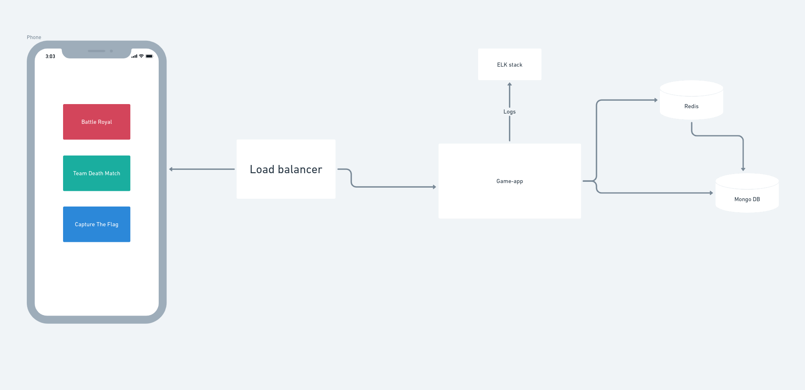

# game-app Service



The `game-app` service provides game statistics based on the geographic area code. This service is defined in the [Protocol Buffers (proto3)](https://developers.google.com/protocol-buffers) language and utilizes gRPC for service communication.

## Building and Running the Service

## Environment Setup

Make sure to create an `.env` file at the root of your project with the necessary environment variables. A `.env.local` file is also used for local builds.

## Building and Running with Docker

The following commands are available for building and running the project with Docker:

- Build the Docker images:  
  `make build`
- Start the Docker containers:  
  `make up`
- Stop the Docker containers:  
  `make down`
- Start the containers if they're stopped:  
  `make start`
- Stop the containers if they're running:  
  `make stop`
- Build and start the containers:  
  `make start-all`

## Running the GRPC Client

To run the GRPC client, use the command:
`make client`

## Building and Running Locally

The following commands are available for local builds and runs:

- Build the client binary:  
  `make build-local-bin-client`
- Build the server binary:  
  `make build-local-bin-server`
- Build both client and server binaries:  
  `make build-local-bin`
- Run the server:
  `make up && ./bin/server -e=.env.local`
- Run the client on different terminal other than the server:
  `make up && ./bin/client -e=.env.local`

## Client Run Configuration

---

```bash
cd clients && go run client.go
```

---

## Requirements task completed marked with [x]:

- [x] Documentation of the web service protocol.
- [x] The code for the web service.
- [x] A document explaining the design choices made when creating the web service, including how your service scales to support more than a million concurrent gamers.
- [ ] Preferred technologies:
  - [x] Using Protobuf for model generation and Data Transfer Objects (DTOs).
  - [x] Using a No-SQL database for persistent storage.
  - [x] Loading sensitive information from environment variables.
  - [x] Adding a logical cache layer (in-memory structures or Redis can be used).
  - [x] Adding a Makefile.
  - [x] Creating separate logical layers for handlers, business logic, cache, and storage.
  - [ ] Writing unit tests.
  - [x] A single docker-compose file to start all services, including the database, cache, etc.
